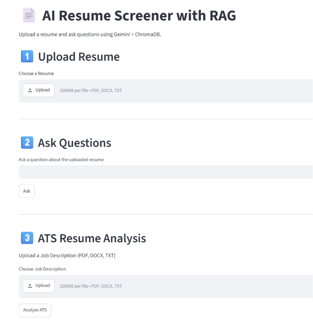
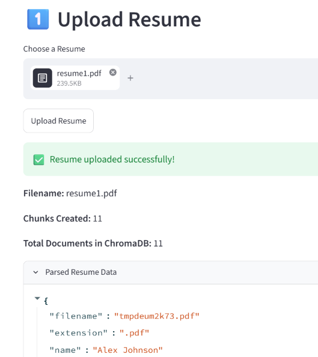
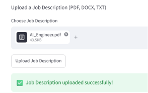
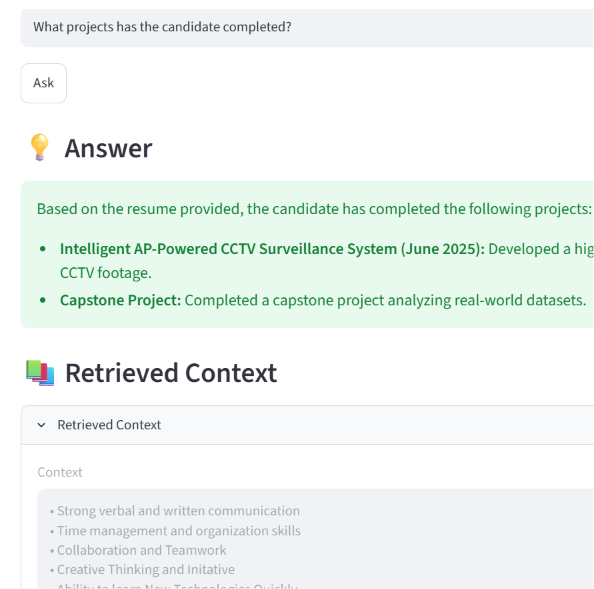
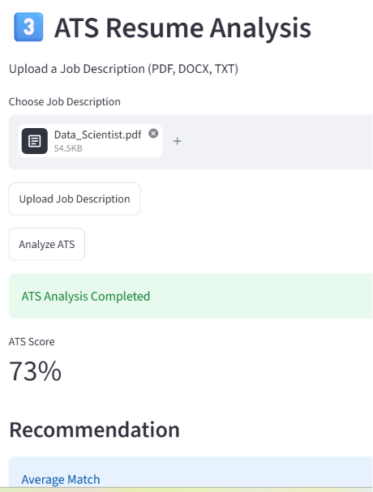
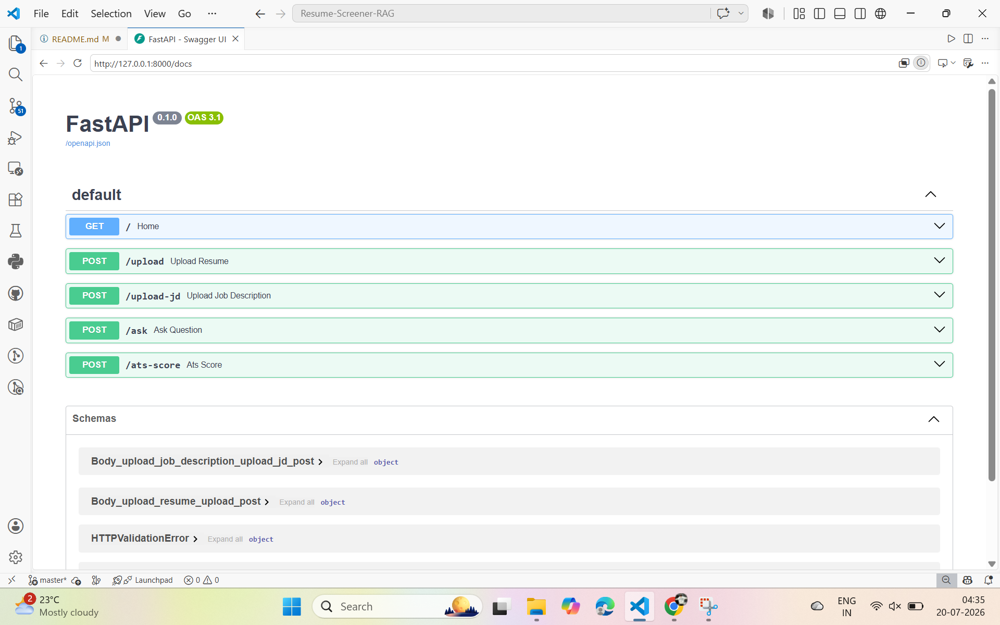

# 📄 AI Resume Screener with RAG

An AI-powered Resume Screener that uses **Retrieval-Augmented Generation (RAG)** to analyze resumes, compare them with job descriptions, calculate ATS compatibility, and answer resume-related questions using **Google Gemini** and **ChromaDB**.

---

## 🚀 Project Overview

AI Resume Screener with RAG helps recruiters and job seekers evaluate resumes against job descriptions. The application extracts resume content, generates semantic embeddings, stores them in **ChromaDB**, retrieves relevant information using RAG, and provides AI-powered answers and ATS analysis.

Users can:

- Upload resumes (PDF, DOCX, TXT)
- Upload job descriptions (PDF, DOCX, TXT)
- Ask questions about resumes using RAG
- Calculate ATS compatibility
- View matched and missing skills
- Receive AI-generated recommendations

---
## 🎯 Demo

### Key Features

- ✅ Resume Upload & Parsing
- ✅ Job Description Upload
- ✅ Resume Question Answering (RAG)
- ✅ ATS Resume Analysis
- ✅ Matched & Missing Skills Detection
- ✅ AI Recommendations
- ✅ ChromaDB Semantic Search
- ✅ FastAPI REST API
- ✅ Streamlit Frontend

## ✨ Features

- 📄 Resume Upload (PDF, DOCX, TXT)
- 📋 Job Description Upload
- 📑 Resume Parsing & Text Extraction
- ✂️ Text Chunking
- 🔍 Semantic Search using ChromaDB
- 🤖 Resume Question Answering (RAG)
- 📊 ATS Score Analysis
- ✅ Matched Skills Detection
- ⚠️ Missing Skills Identification
- 💡 AI Recommendations using Google Gemini
- ⚡ FastAPI REST Backend
- 🎨 Streamlit Frontend
- 📚 Swagger API Documentation

---

# 🏗 Project Architecture

```text
                        +----------------------+
                        |   Streamlit Frontend |
                        +----------+-----------+
                                   |
                                   | HTTP Requests
                                   |
                        +----------v-----------+
                        |    FastAPI Backend   |
                        +----------+-----------+
                                   |
            +----------------------+----------------------+
            |                      |                      |
            |                      |                      |
+-----------v-----------+ +--------v--------+ +-----------v-----------+
| Resume Parser         | | JD Parser       | | ATS Engine            |
+-----------+-----------+ +--------+--------+ +-----------+-----------+
            |                      |                      |
            +----------------------+----------------------+
                                   |
                        +----------v-----------+
                        |   Text Chunking      |
                        +----------+-----------+
                                   |
                        +----------v-----------+
                        | HuggingFace          |
                        | Embeddings           |
                        +----------+-----------+
                                   |
                        +----------v-----------+
                        | ChromaDB Vector DB   |
                        +----------+-----------+
                                   |
                        +----------v-----------+
                        | Retriever (RAG)      |
                        +----------+-----------+
                                   |
                        +----------v-----------+
                        | Google Gemini        |
                        +----------+-----------+
                                   |
                        +----------v-----------+
                        | AI Response          |
                        +----------------------+
```

---

# 📂 Project Structure

```text
Resume-Screener-RAG/
│
├── assets/
│   ├── home.png
│   ├── resume_upload.png
│   ├── job_description.png
│   ├── ats_analysis.png
│   ├── resume_qa.png
│   └── swagger_ui.png
│
├── backend/
│   ├── api.py
│   ├── chunker.py
│   ├── config.py
│   ├── embeddings.py
│   ├── gemini.py
│   ├── ingest.py
│   ├── jd_analyzer.py
│   ├── jd_parser.py
│   ├── main.py
│   ├── models.py
│   ├── parser.py
│   ├── prompts.py
│   ├── rag.py
│   ├── rag_pipeline.py
│   ├── ranking.py
│   ├── retriever.py
│   ├── skills.py
│   ├── temp_upload.py
│   ├── utils.py
│   └── vector_store.py
│
├── data/
│
├── frontend/
│   └── app.py
│
├── .env.example
├── .gitignore
├── LICENSE
├── README.md
└── requirements.txt
```

> **Note:** The `chroma_db/` directory is created automatically when a resume is uploaded and should be excluded from Git using `.gitignore`.

---

# 🛠 Tech Stack

| Category | Technologies |
|----------|--------------|
| Programming Language | Python |
| Backend | FastAPI, Uvicorn |
| Frontend | Streamlit |
| LLM | Google Gemini |
| RAG Framework | LangChain |
| Vector Database | ChromaDB |
| Embedding Model | sentence-transformers/all-MiniLM-L6-v2 |
| Document Processing | PyMuPDF, python-docx |
| Machine Learning | Transformers |
| Environment Variables | python-dotenv |
| API Documentation | Swagger UI |

---

# ⚙️ Installation

## 1. Clone Repository

```bash
git clone https://github.com/your-username/Resume-Screener-RAG.git

cd Resume-Screener-RAG
```

## 2. Create Virtual Environment

```bash
python -m venv venv
```

## 3. Activate Virtual Environment

### Windows

```bash
venv\Scripts\activate
```

### Linux / macOS

```bash
source venv/bin/activate
```

## 4. Install Dependencies

```bash
pip install -r requirements.txt
```

---

# 🔑 Environment Variables

Create a `.env` file in the project root.

```env
GOOGLE_API_KEY=your_gemini_api_key_here
```

Get your API key from:

https://aistudio.google.com/app/apikey

**Never upload your `.env` file to GitHub.**

---

# ▶️ Run the Backend

```bash
uvicorn backend.main:app --reload
```

Backend URL

```
http://127.0.0.1:8000
```

Swagger UI

```
http://127.0.0.1:8000/docs
```

---

# ▶️ Run the Frontend

```bash
streamlit run frontend/app.py
```

Frontend URL

```
http://localhost:8501
```

---

# 🔄 Workflow

1. Upload a Resume (PDF, DOCX, or TXT).
2. Resume content is parsed and cleaned.
3. The resume is divided into semantic chunks.
4. Embeddings are generated using sentence-transformers/all-MiniLM-L6-v2.
5. Embeddings are stored in ChromaDB.
6. Upload a Job Description (PDF, DOCX, or TXT).
7. ATS score, matched skills, missing skills, and recommendations are generated.
8. Ask questions about the uploaded resume.
9. The retriever fetches relevant resume chunks from ChromaDB.
10. Google Gemini generates grounded answers using the retrieved context.

---

# 📡 API Endpoints

| Method | Endpoint | Description |
|--------|----------|-------------|
| GET | `/` | API Health Check |
| POST | `/upload` | Upload Resume |
| POST | `/upload-jd` | Upload Job Description |
| POST | `/ask` | Resume Question Answering |
| POST | `/ats-score` | ATS Analysis |

Swagger Documentation

```
http://127.0.0.1:8000/docs
```

---

# 📸 Screenshots

## 🏠 Home

The landing page of the AI Resume Screener with RAG application.



---

## 📄 Resume Upload

Upload a resume (PDF, DOCX, or TXT). The application parses the document, extracts text, creates semantic chunks, and stores embeddings in ChromaDB.



---

## 📋 Job Description Upload

Upload a job description (PDF, DOCX, or TXT). The application parses the document and prepares it for ATS comparison.



---

## 🤖 Resume Question Answering

Ask questions about the uploaded resume. The RAG pipeline retrieves relevant context from ChromaDB and Google Gemini generates grounded answers.



---

## 📊 ATS Resume Analysis

Compare the uploaded resume with the uploaded job description to generate an ATS score, matched skills, missing skills, recommendations, and AI review.



---

## 📚 FastAPI Swagger UI

Interactive API documentation for testing backend endpoints.



# 🚀 Deployment

### Backend

Deploy on:

- Render
- Railway

### Frontend

Deploy on:

- Streamlit Community Cloud

Configure the following environment variables:

- `GOOGLE_API_KEY`
- `API_URL` (only required when the frontend is deployed separately from the backend)

---

# ⚠️ Known Limitations

- AI-generated responses depend on the Google Gemini API.
- If the Gemini API quota is exceeded, AI Review and Resume Q&A will display a fallback message instead of interrupting the application.
- The application currently processes one uploaded resume and one job description at a time.
---

# 🔮 Future Improvements

- User Authentication
- Resume History
- Cloud Vector Database
- Interview Question Generator
- Recruiter Dashboard
- Batch Resume Screening
- Downloadable PDF Reports
- Docker Support
- CI/CD Pipeline

---

# 📄 License

This project is licensed under the **MIT License**.

See the [LICENSE](LICENSE) file for more information.